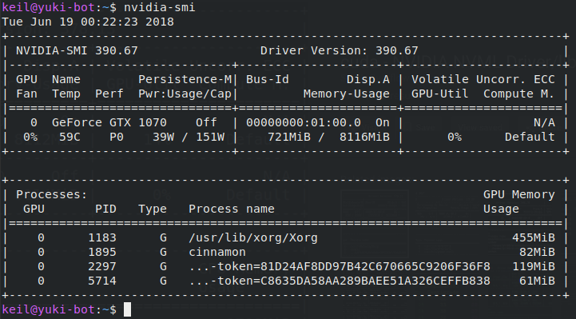
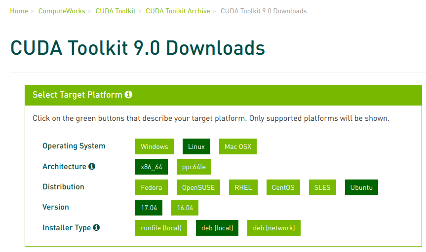
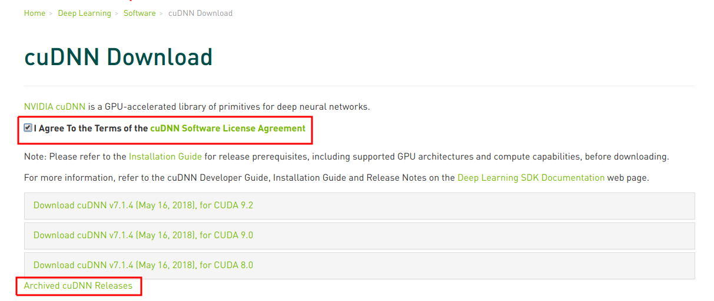
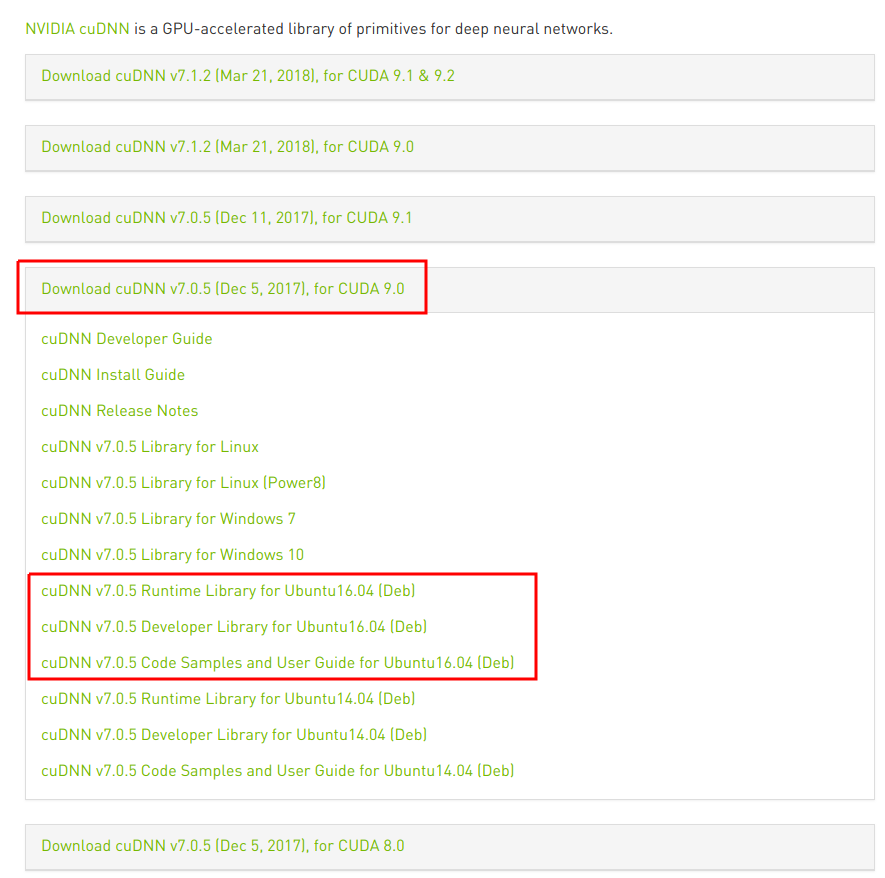
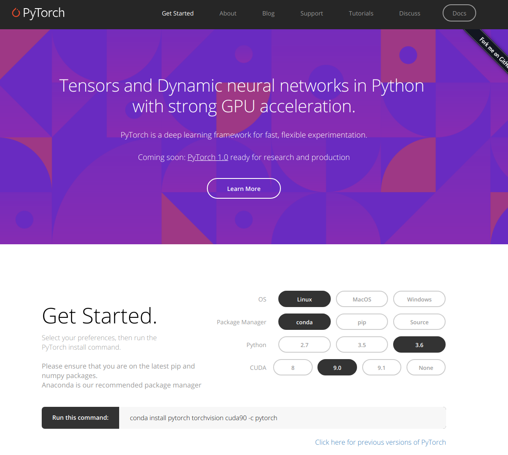

#Up and Running with Ubuntu, Nvidia, Cuda, CuDNN, TensorFlow, and Pytorch
###An in-depth look into getting TensorFlow and Pytorch working on Ubuntu 18.04 with your Nvidia GPU.
#####Kyle M Shannon - June 2018

Building and training deep learning models is laborious task. Ensuring your environments, packages, and GPUs work in harmony adds to that effort. This guide gets fairly in-depth to help users that are relatively new to Linux. Ubuntu's latest long term support (LTS) 18.04 was released around the end of April, so I decided to wipe my current Linux box and start from scratch. Including getting my deep learning environments installed. As 18.04 is relatively new, there may be some confusion when determining which packages to install. hopefully this post helps alleviates those worries. I walk through the process slowly, and provide all terminal inputs and most of the output. I also not just show what I am doing, but try to explain why. 

Hopefully you find this helpful! Let's get into it...

##Contents
- [Preamble](#Preamble)
- [GPU Compatibility](#GPU_Compatibility)
- [Nvidia Drivers](#Nvidia_Drivers)
- [Installing CUDA](#CUDA)
- [Installing CuDNN](#CuDNN)
- [Deep Learning Frameworks](#Deep_Learning_Frameworks)

<a name="Preamble"></a>

###Preamble

**Hardware of Choice**
- Nvidia GTX 1070 (I assume you have a Nvidia GPU)
- Asus Micro-ATX B150M-A D3
- 16 gigs memory
- Intel Core I5-6500 3.2GHz
- 1 TB Western Digital Black Media HDD
- 500 GB Samsung SSD 850 (Linux installed here)

**Software of Choice**
- [Ubuntu](https://www.ubuntu.com/desktop) 18.04 LTS
- [Miniconda](https://conda.io/miniconda.html) (you can also use [Anaconda](https://anaconda.org/) -  the main [difference](https://stackoverflow.com/questions/45421163/anaconda-vs-miniconda))
- Python 3.6 (through miniconda)
- [Terminator](https://gnometerminator.blogspot.com/p/introduction.html) for my terminal
- [Tmux](https://github.com/tmux/tmux/wiki) My terminal mutiplexer (an essential tool for deep learning)
- [SublimeText](https://www.sublimetext.com/3) As my text editor
- [VSCode](https://code.visualstudio.com/) As my main code editor. Use to be Atom...
- [MOC](https://en.wikipedia.org/wiki/Music_on_Console) for music! use to be cmus...

**I use the following conventions in this post:**
- Anything proceeding a $ is a command for you to type into the terminal and run. Do not include the dollar sign.
- Anything proceeding a # is a comment and is there to provide more info for clarity. Do not add these to the terminal.
- Any lines that are tabbed over are console output. Basically what you might see after running a command. I will not include some output, especially if it is long, or not very constructive.

Here is an example:
```shell
$ run this command #comment about the command, do not include this
# comment about the proceeding output from the above command
    some output that is potentially important...
    ack! test failed!!!
    Why did it fail? who knows... StackExchange Knows!
```

<a name="GPU Compatibility"></a>

###GPU Compatibility

First order of business is ensuring your GPU has a high enough compute score. TensorFlow's documentation states:

>GPU card with CUDA Compute Capability 3.0 or higher for building from source and 3.5 or higher for our binaries.

We will not be building TensorFlow from source, but rather using their prebuilt binaries. Therefore you need a score of 3.5 or higher. Open your terminal and run:

```shell
$ sudo lshw -C display | grep product
    product: GP104 [GeForce GTX 1070]
```
Now that you have your GPU model you can cross reference it with [ Nvidia's site]( https://developer.nvidia.com/cuda-gpus) to determine your compute capability. In my case it is a score of 6.1, So I am good to go.

Next we want to ensure all the packages available to Ubuntu are the latest and greatest and then we want to install/upgrade them. Run:

```shell
$ sudo apt update
$ sudo apt upgrade #will ask you Y/n if you want to upgrade
```
Next we will install GPU drivers.

### Nvidia Drivers
Ubuntu comes prepackaged with generic drivers for GPUs. These drivers are not highly optimized, and we don't want to sacrifice any performance. You will first need to find and install the latest Nvidia Drivers for your GPU. There are a few options as outlined in this good [StackExchange post](https://askubuntu.com/questions/61396/how-do-i-install-the-nvidia-drivers/61433#61433): 

>**Nvidia PPA** - Great Performance. It works out of the box for most cards by using the driver included in the PPA (Which are different for each generation of Nvidia cards (This is explained below).

>**Ubuntu Default Recommended Driver** - Ubuntu does an amazing job in figuring out which Nvidia driver you need depending on the card you are using.

>**Nouveau** - This is the open source implementation of the Nvidia driver. They also do an amazing job and although they are not on par with the official drivers or the ones in the PPA (Even more so with the latest Nvidia cards), the speed of development, the commitment, dedication and advancements that they do per week, gives confident that this is fact an option to have and promote.

>**Official Nvidia Site** - This are the official drivers (Same as the ones in the PPA), but the difference is that they do not upgrade automatically and have some issues when updating, uninstalling and installing (Very rare but it happens).

After looking into which driver would be best to use, I went with Ubuntu's PPA. The official [Nvidia driver](https://www.nvidia.com/Download/index.aspx?lang=en-us) had known issues with [X Server](https://askubuntu.com/questions/149206/how-to-install-nvidia-run) and would require more effort to get it working. No thanks... The default Ubuntu driver lacks performance. And the Nouveau driver, while it looks good and open source is nice, it isn't as perforant. Adding the Ubuntu PPA is the best option as they are the latest Nvidia official drivers and have been tested on Ubuntu, so it should be a smooth installation. Ok, to do this run the following commands:

```shell
$ sudo add-apt-repository ppa:graphics-drivers/ppa
```
This command will add the PPA repository to Ubuntu's packaging system. What does this mean? Ubuntu is built off of Debian Linux and thus uses Debian's dpkg packaging system. This system provides Ubuntu with applications to install. Advanced Package Tool (APT) allows you to easily interact with dpkg from the terminal. It oversees package dependencies and upgrading a lot of the software in your OS.

Next you need to determine which driver you need to install. Go to the [PPA repository](https://launchpad.net/~graphics-drivers/+archive/ubuntu/ppa) and scroll down to the bottom of the page. Based on Ubuntu 18.04 I had a choice between nvidia-driver-390 and nvidia-driver-396. I choose 390 because it had been out in the wild longer and thus more potential bugs and issues would have been uncovered by now.

Run the following command to install the driver.
```shell
$ sudo apt install nvidia-driver-390
```
Time to bookmark your tabs, it's time to reboot your computer. I will still be here when your back up and running...

Great you're back. Hopefully! Ok let's check to make sure the driver was installed correctly:
```shell
$ nvidia-smi
```
Your output should look similar to the one below, except your driver version number may be different, as well as your GPU and processes. If it does congratulations! You have Nvidia drivers.



To wrap up the driver portion, you are going to make sure APT doesn't upgrade your driver. Remember you added the PPA to APT and now it is responsible for managing this software. It is important that you stop the software we are installing from upgrading.

Getting GPU support to work requires a symphony of different hardware and software. To ensure compatibility we are going to ask Ubuntu to not update certain software. You can remove this hold at any time. Run:

```shell
$ sudo apt-mark hold nvidia-driver-390
    nvidia-driver-390 set on hold.
# To reverse this operation run:
# sudo apt-mark unhold package_name
```
Now onto to CUDA!

### Installing CUDA 9.0
The question is CUDA 9.0 vs 9.1. From what I have read it seems that version 9.1 works if building from source, whereas 9.0 works out of the box when installing from the binaries. Installing from binaries makes this process just that less tedious, let's stick with that for this go around. 

Go ahead and open up the [CUDA docs](https://docs.nvidia.com/cuda/cuda-installation-guide-linux/index.html). These instructions can be fairly involved to follow, but let's step through them one-by-one.

First we are going to check what gcc and g++ version you have installed. 
```shell
$ gcc --version
    gcc (Ubuntu 7.3.0-16ubuntu3) 7.3.0
$ g++ --version
    g++ (Ubuntu 7.3.0-16ubuntu3) 7.3.0
```

When you installed the PPA Nvidia drivers, the drivers also installed gcc and g++ version 7.x. This is fine, however TensorFlow and CuDNN requires version 6.x for compatibility. We will leave this issue alone for now, but at some point a test will fail, we will resolve this issue then after installing CUDA.

Let's install the kernel headers. For more info on what linux headers [here](https://askubuntu.com/questions/598948/what-does-linux-headers-uname-r-do) and especially [here](https://answers.launchpad.net/ubuntu/+question/54157). Essentially, kernel headers are files used to compile the kernel and any other applications/software (in this case CUDA) that depend on information within those header files. To install run:

```shell
$ sudo apt install linux-headers-$(uname -r)
    Reading package lists... Done
    Building dependency tree       
    Reading state information... Done
    linux-headers-4.15.0-23-generic is already the newest version (4.15.0-23.25).
    linux-headers-4.15.0-23-generic set to manually installed.
```
Now you need to download CUDA and install it. You can grab CUDA 9.0 from this official [Nvidia archive](https://developer.nvidia.com/cuda-90-download-archive). Look at the image below to see which options to select.



Once it is finished downloading run the following:
```shell
$ cd Downloads/ #navigate to where the .deb file downloaded, Downloads directory in my case
$ sudo dpkg -i cuda-repo-ubuntu1704-9-0-local_9.0.176-1_amd64.deb
    Selecting previously unselected package cuda-repo-ubuntu1704-9-0-local.
    (Reading database ... 224086 files and directories currently installed.)
    Preparing to unpack cuda-repo-ubuntu1704-9-0-local_9.0.176-1_amd64.deb ...
    Unpacking cuda-repo-ubuntu1704-9-0-local (9.0.176-1) ...
    Setting up cuda-repo-ubuntu1704-9-0-local (9.0.176-1) ...

    The public CUDA GPG key does not appear to be installed.
    To install the key, run this command:
    sudo apt-key add /var/cuda-repo-9-0-local/7fa2af80.pub # run the command the command they provide to install the GPG key
$ sudo apt-key add /var/cuda-repo-9-0-local/7fa2af80.pub
$ sudo apt update
$ sudo apt install cuda #might take a few minutes to finish
```
Congratulations! CUDA 9.0 is installed. Let's hold this package as well from updates:
```shell
$ sudo apt-mark hold cuda
```
Lastly you need your PATH variable in your .bashrc file. This hidden file is located in your home directory. You need to add the following line to the end of your .bashrc file:

```shell
export PATH=/usr/local/cuda-9.0/bin${PATH:+:${PATH}}
```
You can use any text editor you like, or nano or vim. but open your .bashrc file and add that to the end of the file save it and close. You will need to start a new terminal session (close and reopen your terminal) for the .bashrc file changes to get loaded. .bashrc is a shell script that bash runs every time a session is started. You are adding the PATH variable so that CUDA can be found in your PATH.
```shell
$ subl .bashrc #opens .bashrc file in sublime text, I copy pasta the above line of code then save and close sublime.
$ cat .bashrc | grep cuda
    export PATH=/usr/local/cuda-9.0/bin${PATH:+:${PATH}} #you should see this output
```
Great CUDA is ready to be tested! 
```shell
$ cd #navigate back to home
$ cat /proc/driver/nvidia/version
    NVRM version: NVIDIA UNIX x86_64 Kernel Module  390.67  Fri Jun  1 04:04:27 PDT 2018
    GCC version:  gcc version 7.3.0 (Ubuntu 7.3.0-16ubuntu3)
$ nvcc --version
    nvcc: NVIDIA (R) Cuda compiler driver
    Copyright (c) 2005-2017 NVIDIA Corporation
    Built on Fri_Sep__1_21:08:03_CDT_2017
    Cuda compilation tools, release 9.0, V9.0.176
```
If this is all good, then CUDA is installed and working correctly. GCC is still at version 7.x, but we will fix this soon. For now let's tackle CuDNN.

### CuDNN
Check out the official [docs](https://docs.nvidia.com/deeplearning/sdk/cudnn-install/index.html#installcuda) on CuDNN. We will be stepping through these. First you need to make sure you have created a free account with [Nvidia's Developer Program.](https://developer.nvidia.com) Once you sign up, verify your email and are ready to go, you can sign in from [this link](https://developer.nvidia.com/rdp/cudnn-download) and it should take you directly to the download CuDNN page. Follow the steps in the images below to find the specific CuDNN version. I choose 7.05 based on what TensorFlow suggested at the time.

Agree to the terms and thyen look at the bottom of the list for a link to archived cuDNN releases. 


This will take you to the archives, where you can now look for cuDNN v7.0.5 for CUDA 9.0.
Download all three of the following .deb files:
- cuDNN v7.0.5 Runtime Library for Ubuntu16.04 (Deb)
- cuDNN v7.0.5 Developer Library for Ubuntu16.04 (Deb)
- cuDNN v7.0.5 Code Samples and User Guide for Ubuntu16.04 (Deb)



After you have downloaded them, run these next commands: 
```shell
$ cd Downloads/ #navigate to where you downloaded them, Downloads/ for me
# Start with the runtime file
$ sudo dpkg -i libcudnn7_7.0.5.15-1+cuda9.0_amd64.deb
    Selecting previously unselected package libcudnn7.
    (Reading database ... 236355 files and directories currently installed.)
    Preparing to unpack libcudnn7_7.0.5.15-1+cuda9.0_amd64.deb ...
    Unpacking libcudnn7 (7.0.5.15-1+cuda9.0) ...
    Setting up libcudnn7 (7.0.5.15-1+cuda9.0) ...
    Processing triggers for libc-bin (2.27-3ubuntu1) ...
    /sbin/ldconfig.real: /usr/local/cuda-9.0/targets/x86_64-linux/lib/libcudnn.so.7 is not a symbolic link
# then the developer file --dev .debs typically include the source code
$ sudo dpkg -i libcudnn7-dev_7.0.5.15-1+cuda9.0_amd64.deb 
    (Reading database ... 236362 files and directories currently installed.)
    Preparing to unpack libcudnn7-dev_7.0.5.15-1+cuda9.0_amd64.deb ...
    Unpacking libcudnn7-dev (7.0.5.15-1+cuda9.0) over (7.0.5.15-1+cuda9.0) ...
    Setting up libcudnn7-dev (7.0.5.15-1+cuda9.0) ...
    update-alternatives: using /usr/include/x86_64-linux-gnu/cudnn_v7.h to provide /usr/include/cudnn.h (libcudnn) in auto mode
# finally the doc file --necessary for running the installation test
$ sudo dpkg -i libcudnn7-doc_7.0.5.15-1+cuda9.0_amd64.deb 
    Selecting previously unselected package libcudnn7-doc.
    (Reading database ... 236362 files and directories currently installed.)
    Preparing to unpack libcudnn7-doc_7.0.5.15-1+cuda9.0_amd64.deb ...
    Unpacking libcudnn7-doc (7.0.5.15-1+cuda9.0) ...
    Setting up libcudnn7-doc (7.0.5.15-1+cuda9.0) ...
```
Great, that wasn't too bad. Let's test the CuDNN installation.
```shell
$ cd #back to home
$ cp -r /usr/src/cudnn_samples_v7/ $HOME #copy the test mnist files over to home.
$ cd  $HOME/cudnn_samples_v7/mnistCUDNN
$ make clean && make
    rm -rf *o
    rm -rf mnistCUDNN
    /usr/local/cuda/bin/nvcc -ccbin g++ -I/usr/local/cuda/include -IFreeImage/include  -m64    -gencode arch=compute_30,code=sm_30 -gencode arch=compute_35,code=sm_35 -gencode arch=compute_50,code=sm_50 -gencode arch=compute_53,code=sm_53 -gencode arch=compute_53,code=compute_53 -o fp16_dev.o -c fp16_dev.cu
    In file included from /usr/local/cuda/include/host_config.h:50:0,
                    from /usr/local/cuda/include/cuda_runtime.h:78,
                    from <command-line>:0:
    /usr/local/cuda/include/crt/host_config.h:119:2: error: #error -- unsupported GNU version! gcc versions later than 6 are not supported!
    #error -- unsupported GNU version! gcc versions later than 6 are not supported!
    ^~~~~
    Makefile:203: recipe for target 'fp16_dev.o' failed
    make: *** [fp16_dev.o] Error 1
```
And now we run into trouble with gcc/++ 7. Now we will need to mitigate the gcc issue. Lets install gcc 6.x and g++ 6.x Then we can create a symlink to tell CuDNN to look for version 6. We can leave version 7 installed as well.
```shell
$ sudo apt install gcc-6 g++-6
# ln -s makes a symbolic link so cuda looks for gcc version 6 where we tell it to look.
$ sudo ln -s /usr/bin/gcc-6 /usr/local/cuda/bin/gcc
$ sudo ln -s /usr/bin/g++-6 /usr/local/cuda/bin/g++

```
What exactly is a symbolic link?
>A symbolic link, also termed a soft link, is a special kind of file that points to another file, much like a shortcut in Windows or a Macintosh alias. Unlike a hard link, a symbolic link does not contain the data in the target file. It simply points to another entry somewhere in the file system. This difference gives symbolic links certain qualities that hard links do not have, such as the ability to link to directories, or to files on remote computers networked through NFS. Also, when you delete a target file, symbolic links to that file become unusable, whereas hard links preserve the contents of the file https://kb.iu.edu/d/abbe

Alright, let's try this test again and make sure gcc6 and g++6 is working as intended.
```shell
$ make clean && make
    rm -rf *o
    rm -rf mnistCUDNN
    /usr/local/cuda/bin/nvcc -ccbin g++ -I/usr/local/cuda/include -IFreeImage/include  -m64    -gencode arch=compute_30,code=sm_30 -gencode arch=compute_35,code=sm_35 -gencode arch=compute_50,code=sm_50 -gencode arch=compute_53,code=sm_53 -gencode arch=compute_53,code=compute_53 -o fp16_dev.o -c fp16_dev.cu
    g++ -I/usr/local/cuda/include -IFreeImage/include   -o fp16_emu.o -c fp16_emu.cpp
    g++ -I/usr/local/cuda/include -IFreeImage/include   -o mnistCUDNN.o -c mnistCUDNN.cpp
    /usr/local/cuda/bin/nvcc -ccbin g++   -m64      -gencode arch=compute_30,code=sm_30 -gencode arch=compute_35,code=sm_35 -gencode arch=compute_50,code=sm_50 -gencode arch=compute_53,code=sm_53 -gencode arch=compute_53,code=compute_53 -o mnistCUDNN fp16_dev.o fp16_emu.o mnistCUDNN.o  -LFreeImage/lib/linux/x86_64 -LFreeImage/lib/linux -lcudart -lcublas -lcudnn -lfreeimage -lstdc++ -lm
```
so far so good, and finally:
```shell
$  ./mnistCUDNN
    cudnnGetVersion() : 7005 , CUDNN_VERSION from cudnn.h : 7005 (7.0.5)
    Host compiler version : GCC 6.4.0
    There are 1 CUDA capable devices on your machine :
    device 0 : sms 15  Capabilities 6.1, SmClock 1784.5 Mhz, MemSize (Mb) 8116, MemClock 4004.0 Mhz, Ecc=0, boardGroupID=0
    Using device 0

    Testing single precision
    Loading image data/one_28x28.pgm
    Performing forward propagation ...
    Testing cudnnGetConvolutionForwardAlgorithm ...
    Fastest algorithm is Algo 1
    Testing cudnnFindConvolutionForwardAlgorithm ...
    ^^^^ CUDNN_STATUS_SUCCESS for Algo 1: 0.027648 time requiring 3464 memory
    #... lots of additional lines...
    # FInal few lines should say...
    Result of classification: 1 3 5

    Test passed!
```
Awesome! CuDNN is working. Next order of business... you guessed it. Hold these packages from being updated and remove (you can delete the .deb files as well in your Downloads/) the copied samples directory we used for the previous test:
```shell
$ sudo apt-mark hold libcudnn7 libcudnn7-dev libcudnn7-doc #These are the three .deb files we installed
    libcudnn7 set on hold.
    libcudnn7-dev set on hold.
    libcudnn7-doc set on hold.
$ rm -r cudnn_samples_v7/
```
Now we are getting into the home stretch. Time to install our deep learning frameworks. First up is TensorFlow, as it is generally more picky then pytorch. 

### Deep Learning Frameworks
First create a new virtual environment with conda. I called it 'tensorflow'. Below I make a comment about initializing the env with pip and not installing pip after the env has been created. There used to be (might still be) an insidious bug where if you installed pip after you created an env pip installs would install packages globally regardless if you were in an activated env. This is highly undesirable behavior. The solution was to initialize with pip. This bug might be mitigated by now. 


```shell
$ cd
$ conda create -n tensorflow python=3.6 pip numpy #remember to initialize the env with pip here.
# activate your conda environment
$ conda source activate tensorflow
# now your user and hostname will be prepended with a (tensorflow) e.g. below
# keil@yuki-bot:~$
# (tensorflow) keil@yuki-bot:~$
```
Now for TensorFlow. I got the url below from their [website](https://www.tensorflow.org/install/install_linux#the_url_of_the_tensorflow_python_package). Important to make sure you are installing the package: tensorflow-gpu and NOT tensorflow. Otherwise you won't be doing much GPU computing...

I grabbed the python 3.6 GPU support url

```shell
$ pip install --ignore-installed --upgrade https://storage.googleapis.com/tensorflow/linux/gpu/tensorflow_gpu-1.8.0-cp36-cp36m-linux_x86_64.whl
$ conda list | grep tensor #should show something like the following
    tensorboard               1.8.0                     <pip>
    tensorflow-gpu            1.8.0                     <pip> #this should say tensorflow-gpu... not tensorflow
```
Now we can test our tensorflow install by starting a python repl in the console and importing the tensorflow library.
```shell
$ python
    Python 3.6.5 |Anaconda, Inc.| (default, Apr 29 2018, 16:14:56) 
    [GCC 7.2.0] on linux
    Type "help", "copyright", "credits" or "license" for more information.
>>> import tensorflow as tf
>>> hello = tf.constant('Hello, TensorFlow!')
>>> sess = tf.Session()
    2018-06-18 15:54:49.477048: I tensorflow/core/platform/cpu_feature_guard.cc:140] Your CPU supports instructions that this TensorFlow binary was not compiled to use: AVX2 FMA
    2018-06-18 15:54:49.569847: I tensorflow/stream_executor/cuda/cuda_gpu_executor.cc:898] successful NUMA node read from SysFS had negative value (-1), but there must be at least one NUMA node, so returning NUMA node zero
    2018-06-18 15:54:49.570534: I tensorflow/core/common_runtime/gpu/gpu_device.cc:1356] Found device 0 with properties: 
    name: GeForce GTX 1070 major: 6 minor: 1 memoryClockRate(GHz): 1.7845
    pciBusID: 0000:01:00.0
    totalMemory: 7.93GiB freeMemory: 7.46GiB
    2018-06-18 15:54:49.570548: I tensorflow/core/common_runtime/gpu/gpu_device.cc:1435] Adding visible gpu devices: 0
    2018-06-18 15:54:49.763041: I tensorflow/core/common_runtime/gpu/gpu_device.cc:923] Device interconnect StreamExecutor with strength 1 edge matrix:
    2018-06-18 15:54:49.763069: I tensorflow/core/common_runtime/gpu/gpu_device.cc:929]      0 
    2018-06-18 15:54:49.763089: I tensorflow/core/common_runtime/gpu/gpu_device.cc:942] 0:   N 
    2018-06-18 15:54:49.763303: I tensorflow/core/common_runtime/gpu/gpu_device.cc:1053] Created TensorFlow device (/job:localhost/replica:0/task:0/device:GPU:0 with 7205 MB memory) -> physical GPU (device: 0, name: GeForce GTX 1070, pci bus id: 0000:01:00.0, compute capability: 6.1)
>>> print(sess.run(hello))
    b'Hello, TensorFlow!'
>>> exit()
```
Great all looks good. Congratulations, you have TensorFlow installed with GPU support. And you do not need to hold tensorflow with APT, conda is in charge of managing the upgrade for tensorflow. 

now deactivate your tensorflow conda env and create one for pytorch:
```shell
$ source deactivate tensorflow
$ conda create -n pytorch python=3.6 pip numpy
$ conda source activate pytorch
```
Head over to the pytorch website and generate a command to install pytorch. The below image shows the options I selected:



```shell
$ conda install pytorch torchvision cuda90 -c pytorch
$ conda list | grep torch
    # packages in environment at /home/keil/miniconda3/envs/pytorch:
    cuda90                    1.0                  h6433d27_0    pytorch
    pytorch                   0.4.0           py36_cuda9.0.176_cudnn7.1.2_1  [cuda90]  pytorch
    torchvision               0.2.1                    py36_1    pytorch
$ python #start the python interpretor to test pytorch for GPU support
    Python 3.6.5 |Anaconda, Inc.| (default, Apr 29 2018, 16:14:56) 
    [GCC 7.2.0] on linux
    Type "help", "copyright", "credits" or "license" for more information.
>>> import torch
>>> torch.cuda.current_device()
    0
>>> torch.cuda.device(0)
    <torch.cuda.device object at 0x7faff01a8860>
>>> torch.cuda.get_device_name(0)
    'GeForce GTX 1070'
>>> exit()
$ source deactivate pytorch
```
Awesome! Pytorch is looking good to go. 

Well that is it. You are all done. You have installed tensorflow and pytorch, both with GPU support in their own conda virtual envs. You installed CUDA 9.0, CuDNn 7.0.5, gcc/g++ 6.0, latest official nvidia GPU drivers for Ubuntu, and the latest kernel headers. 

Hopefully all of this worked for you and you learned a few things a long the way. The biggest challenge with getting GPU support for deep learning frameworks are making sure all the different versions of everything play nice together. That just requires some research and reading the official docs from Ubuntu, Nvidia, TensorFlow and Pytorch. Other than that it is mostly straightforward copy pasta of commands. 

Useful sites for good quality info I found were StackExchange and the Nvidia [developer forms](https://devtalk.nvidia.com/). When reading online forums just make sure the info is up to date. A lot of the answers and questions are old and no longer suitable. I am sure this post will be old soon too. I will try to update it when necessary.

Thanks for slogging through this post. Have fun deep learning!

Cheers,
Kyle
